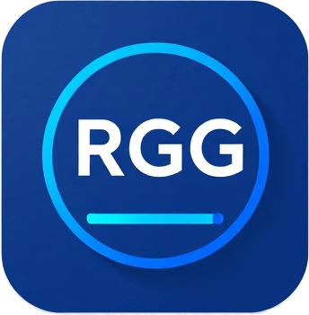

# RGG Bar
Программа для вывода списка платформ на экран для стримерского ивента SoloRGG

## Инструкция
1. Скачиваем последнюю версию [тут](https://github.com/FastStim/RggBar/releases)
2. Запускаем программу
3. Добавляем как браузер с url localhost:6660 (можно поглядеть адрес в help)
4. Вы великолепны

## Решение проблем
- Сбросить кеш OBS
- Перезапустить программу RGGBar

*Будет обновляться по мере поступления*